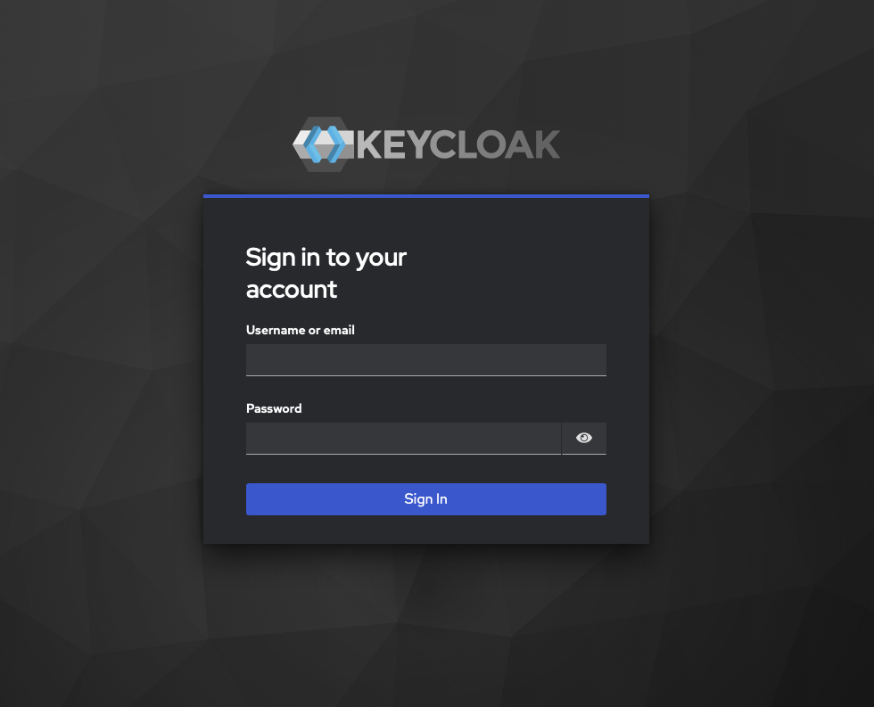
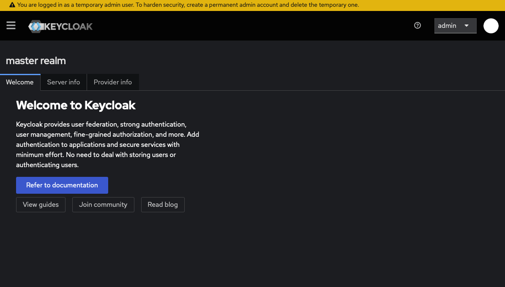

# Getting Started with Red Hat KeyCloak

## What is KeyCloak? 🗝️

RedHat KeyCloak is an open-source Identity and Access Management (IAM) solution that enables you to seecure application and services with minimal effort. It supports standard products like OAuth2, OpenID Connect, and SAML. KeyCloak provides: 

+ **Single-Sign-On (SSO)**: Users log in once and gain access to multiple applications

+ **Centralized User Management**: Manage users, roles, and groups in one place. 

+ **Social Login**: Integrate with social identity providers like Google, GitHub etc. 

+ **Multi-Factor Authentication (MFA)**: Enhance security with additional authentication. 

+ **Authorizatopm Services**: Implement fine-grained authorizaiton policies. 

## Installation and Setup 🛠️

We need a working **Keycloak** setup to learn about Keycloak with hands-on exercises. Therefore, I am going to show you how to setup a practice lab environment with Docker Containers. 

First let us download the docker image for *Keycloak*. 

**Step 1**: 

```bash
# Downloading Docker image
docker pull quay.io/keycloak/keycloak:latest
```

**Step 2**:

Now, let us create a container instance. Using the below command I can easily get a keycloak container instance to run. 

```bash
# Using docker container run 
docker container run -d -p 8080:8080 \
-e KC_BOOTSTRAP_ADMIN_USERNAME=admin \
-e KC_BOOTSTRAP_ADMIN_PASSWORD=admin \
--name keycloak quay.io/keycloak/keycloak:latest \
start-dev 
```

But this is the best possible way to setup a keycloak setup. Because in the above case, the all the *Keycloak* configurations like `realms, users, groups` etc gets stored in an in memory database. There is change that we might loose that information is something happens to the container instanace. Therefore, it would be better to have a setup where we can persist the configuration and settings. 

When I looked at how *Keycloak* persist the data, what I found was that it uses a *Postgres* Database to save all the critical information like configurations and settings. The other customizations like, `themes` and `providers` gets saved on the filesystem. Also to keep the self-signed certificates we need another folder. Therefore I need to create another folder named `certs` in the same project root folder. Therefore considering all of these needs let me show you how to setup the proper way to setup the container instance using the `docker-compose.yml` file. 

```yaml

services:
  keycloak:
    image: quay.io/keycloak/keycloak:latest
    container_name: keycloak
    volumes:
      # Mount your themes, providers, and certificates directories
      - ./themes:/opt/keycloak/themes/  # No change, but included for context
      # Mount a local directory for custom providers (.jar files).
      - ./providers:/opt/keycloak/providers/  # No change, but included for context
      - ./certs:/opt/keycloak/certs:ro  # Mount certs directory as read-only
    command:
      - start
      - "--db=postgres"
      - "--db-url-host=keycloak-postgres"
      - "--db-url-database=${POSTGRES_DB}"
      - "--db-username=${POSTGRES_USER}"
      - "--db-password=${POSTGRES_PASSWORD}"
      - "--https-key-store-file=/opt/keycloak/certs/keystore.jks"  # Added parameter for HTTPS

    environment:
      # Keycloak Admin Credentials
      KC_BOOTSTRAP_ADMIN_USERNAME: ${KEYCLOAK_ADMIN_USER}
      KC_BOOTSTRAP_ADMIN_PASSWORD: ${KEYCLOAK_ADMIN_PASSWORD}

      # Database Configuration
      KC_DB: postgres
      KC_DB_URL_HOST: keycloak-postgres
      KC_DB_URL_DATABASE: ${POSTGRES_DB}
      KC_DB_USERNAME: ${POSTGRES_USER}
      KC_DB_PASSWORD: ${POSTGRES_PASSWORD}
      KC_DB_SCHEMA: public

      # Set the hostname for production-like behavior
      KC_HOSTNAME: localhost # No change, but included for context

      # Enable HTTPS and set key store parameters
      # KC_HTTPS_CERTIFICATE_FILE: /opt/keycloak/certs/keystore.jks  # Removed as it's passed in command
      # KC_HTTPS_CERTIFICATE_KEY_FILE: /opt/keycloak/certs/keystore.jks  # Removed as it's passed in command
      KC_HTTPS_PORT: 8443
      KC_HTTPS_CLIENT_AUTH: none  # Disable client authentication
      KC_HTTP_ENABLED: false # Disable the HTTP endpoint
      KC_HOSTNAME_STRICT: false
      KC_HOSTNAME_STRICT_HTTPS: false
    ports:
      - "8443:8443"
      - "8080:8080" # Keep 8080 open for http redirects and reverse proxies to use
    depends_on:
      keycloak-postgres:
        condition: service_healthy
    networks:
      - keycloak_net
    restart: unless-stopped


  keycloak-postgres:
    image: postgres:17 # Use a stable and valid postgres version
    container_name: keycloak-postgres 
    volumes:
      - postgres_data:/var/lib/postgresql/data
    environment:
      POSTGRES_DB: ${POSTGRES_DB}
      POSTGRES_USER: ${POSTGRES_USER}
      POSTGRES_PASSWORD: ${POSTGRES_PASSWORD}
    healthcheck: # Check if the database is ready to accept connections
      test: ["CMD-SHELL", "pg_isready -U ${POSTGRES_USER} -d ${POSTGRES_DB}"]
      interval: 10s
      timeout: 5s
      retries: 5
    networks:
      - keycloak_net
    restart: unless-stopped

networks: 
  keycloak_net:
volumes:
  postgres_data:
```

Here you can see what we sensitive information like, `usernames`, `passwords` I have moved to a `.env` file which is in the same folder. Below is how it looks like. 

```bash
# Keycloak Admin User
KEYCLOAK_ADMIN_USER=admin
KEYCLOAK_ADMIN_PASSWORD=change_me

# PostgreSQL Database connection settings
POSTGRES_DB=postgres
POSTGRES_USER=keycloak
POSTGRES_PASSWORD=change_me
```
Before starting the things we need to generate self-signed certificates. To enable HTTPS communication on the Keycloak. I was able to get that done using `openssl` utility. 

```bash
openssl req -x509 -out server.crt -keyout server.key \
  -newkey rsa:2048 -nodes -sha256 \
  -subj '/CN=localhost' -extensions EXT -config <( \
   printf "[dn]\nCN=localhost\n[req]\ndistinguished_name = dn\n[EXT]\nsubjectAltName=DNS:localhost\nkeyUsage=digitalSignature\n")
```

Now I need to pacakge these into a *Java Keystore (`.jks`) file. Let me do what with the help of `keytool` utility. 

```bash
keytool -genkeypair -storepass password -storetype PKCS12 -keyalg RSA -keysize 2048 -dname "CN=localhost" -alias server -ext "SAN:c=DNS:localhost,IP:127.0.0.1" -keystore keycloak.p12
keytool -importkeystore -srckeystore keycloak.p12 -srcstorepass password -srcstoretype pkcs12 -destkeystore keystore.jks -deststorepass password
```


Right, then let's create the container instances. 

```bash
# Creating the docker containers and starting them. 
docker-compose up -d
# Validate 
docker container ps
```

Now let us go to the url [localhost:8443](http://localhost:8443) and see. 

You might have to accept the risk message shown in the bowser. Thtat message is coming because we are using a self-signed certificate. Finally, I should be able to log in. 



Below is the home page of the admin. 



## Keycloak Realms, Clients and Users

Now that we have a working Keycloak environment, let's understand the core components of Keycloak. At its heart, Keycloak organizes our identities and access controls around three fundamental building blocks: **Realms, Clients, and Users**. Grasping these concepts is crucial for effectively setting up and managing your authentication and authorization flows.

### Realms: Isolation for Your Identities 🛡️

A **Realm** in **Keycloak** serves as the highest level of organizational and security isolation. You can think of it as a distinct, self-contained **namespace or container for a complete set of security configurations**. This includes:

- **Users**: A unique set of user accounts belonging specifically to that realm. Users from one realm cannot log in to applications in another realm unless explicitly configured for cross-realm authentication (which is an advanced scenario).
    
- **Applications (Clients)**: All applications and services that are secured by Keycloak must be registered within a specific realm. A client registered in Realm A cannot directly use users or configurations from Realm B.
    
- **Roles and Groups**: Permissions (roles) and collections of users (groups) are defined at the realm level, or at the client level, and are unique to that realm.
    
- **Authentication Settings**: This includes global settings for login flows, password policies, session timeouts, multi-factor authentication (MFA) requirements, and security policies.
    
- **Identity Providers (IdPs)**: External identity sources (like Google, GitHub, or another corporate LDAP/Active Directory) are configured per realm, allowing users to log in using their existing credentials from those external systems.


#### Why are Realms so important? Multi-Tenancy and Isolation.**

The primary purpose of realms is to provide **strong isolation** for your identities and their associated security settings. This makes Keycloak ideal for:

- **Multi-tenant applications**: If you're building a SaaS application that serves multiple organizations, each organization could potentially have its own realm, ensuring their user data and security policies are completely separate.
    
- **Different User Bases**: You can have one realm for your internal employees (with strict password policies and integrated corporate directory), another realm for your external customers (perhaps allowing social logins), and yet another for partners.
    
- **Independent Security Policies**: Each realm can enforce its own unique security rules. For example, one realm might require MFA for all users, while another might only require it for administrative roles.
    
- **Customization**: Realms allow for specific branding (login page themes), login flows, and user attributes tailored to that particular user base.


> 💡 **NOTE: The `master` Realm:**
>
> By default, Keycloak comes with a built-in `master` realm. This realm is special because it's primarily used for **administering Keycloak itself**. Your initial Keycloak administrator account resides in the `master` realm.
> **Best Practice:** You should **always create a new, dedicated realm for your applications and their users**. Never use the `master` realm for your production applications. This practice ensures better security, easier management, and prevents accidental misconfigurations from affecting Keycloak's core administration.

### Clients: Representing Your Applications 💻

A **Client** in Keycloak is a software entity that wishes to interact with Keycloak to authenticate users and/or obtain authorization to access protected resources. In essence, a client is your application or service registered with Keycloak. When you register a client, you define the rules of engagement for how it will leverage Keycloak's security services.

Key properties you configure for a client include:

- **Client ID**: This is a **unique identifier** for your application within the specific realm. It's how Keycloak recognizes your application when it makes authentication or authorization requests. Think of it as your app's "username" with Keycloak.
    
- **Client Protocol**: This defines the security protocol the client will use to communicate with Keycloak.
    
    - **OpenID Connect (OIDC)**: This is the **recommended and default protocol for modern web, mobile, and single-page applications**. It layers authentication (knowing _who_ the user is) on top of OAuth2's authorization capabilities.
        
    - **SAML 2.0**: Used primarily for enterprise federation and legacy applications.
        
    - **OAuth 2.0**: The underlying authorization framework that OIDC builds upon. While OIDC is typically preferred for user-facing apps, pure OAuth 2.0 might be used for machine-to-machine communication (Client Credentials flow).
        
- **Access Type**: This crucial setting dictates how the client handles its credentials and interacts with Keycloak's token endpoint.
    
    - **Confidential**: This type is used for **server-side applications** (e.g., a traditional web application with a backend, a microservice). These applications can securely store a **`client_secret`** (a password-like credential) on their backend server. When exchanging authorization codes for tokens, they present this secret to Keycloak, which helps confirm their identity. This provides a higher level of security.
        
        - **Example**: A Python/Django web application's backend server securely stores a `client_secret`and uses it to authenticate itself with Keycloak when requesting an access token after a user logs in.
            
    - **Public**: Designed for **client-side applications** that cannot securely store a `client_secret`. This includes:
        
        - **Single-Page Applications (SPAs)** built with frameworks like React, Angular, Vue.js (as their code runs in the user's browser, a secret would be exposed).
            
        - **Native mobile applications** (iOS, Android).
            
        - Desktop applications.
            
            These clients typically rely on PKCE (Proof Key for Code Exchange) as an extension to the Authorization Code Flow to prevent authorization code interception attacks. They don't use a client_secret for token exchange.
            
        - **Example**: A React SPA that authenticates with Keycloak. It will use PKCE for a more secure Authorization Code flow without exposing a secret.
            
    - **Bearer-only**: This type is used exclusively for **Resource Servers** (your APIs or services that protect data). A Bearer-only client does **not initiate logins** itself. Its sole purpose is to **validate incoming access tokens** (Bearer tokens) issued by Keycloak. If a request comes to a Bearer-only client without a valid token, it's rejected.
        
        - **Example**: Your FastAPI AI Service API. It doesn't present a login page or ask users to authenticate. It just receives requests with an `Authorization: Bearer <token>` header and verifies that token against Keycloak.
            
- **Valid Redirect URIs**: These are the **only URLs** to which Keycloak will redirect the user's browser after a successful login or consent. They must be precisely registered to prevent attackers from redirecting users to malicious sites and intercepting authorization codes or tokens. Strict adherence to these URIs is a critical security measure.
    
    - **Example**: For `my-web-app.com`, you might have `https://my-web-app.com/callback` and `https://my-web-app.com/silent-refresh.html`.
        
- **Web Origins**: This property is relevant for browser-based applications that make direct JavaScript requests to Keycloak (e.g., for `silent check-sso` or to retrieve public realm configuration). It defines the **Cross-Origin Resource Sharing (CORS)** origins that are permitted to make such requests.
    
    - **Example**: For an SPA hosted at `https://my-spa-app.com`, you'd typically set `Web Origins` to `https://my-spa-app.com`.
        

### Users: Managing Identities 🧑‍🤝‍🧑

**Users** represent the individuals or entities that will authenticate against your **Keycloak realm**. *Keycloak* provides a comprehensive system for managing these identities, which can be stored directly within *Keycloak's* database or federated from external systems. 

Key aspects of user management in Keycloak include:

- **User Account Creation and Management**:
    
    - Administrators can manually create, update, and delete user accounts through the Keycloak admin console.
        
    - Users can often self-register, depending on realm settings.
        
    - User details like username, email, first name, and last name are stored.
        
- **Credentials Management**:
    
    - Users can have various types of credentials, most commonly passwords. Keycloak enforces password policies (strength, expiry) configured at the realm level.
        
    - Support for One-Time Passwords (OTP) via authenticator apps (e.g., Google Authenticator, FreeOTP) for Multi-Factor Authentication (MFA).
        
    - WebAuthn (FIDO2) for passwordless authentication using security keys.
        
- **Roles and Groups**:
    
    - **Roles**: Define specific permissions or capabilities (e.g., `admin`, `editor`, `customer`). Roles can be assigned directly to users or to groups.
        
    - **Groups**: Collections of users. Assigning roles to groups simplifies permission management, as all users in a group inherit its roles.
        
        - **Example**: All users in the "Marketing Team" group automatically get the "marketing-contributor" role.
            
- **User Attributes**: Beyond standard fields, you can define custom attributes for users (e.g., "department", "employee ID", "phone number"). These attributes can be included in ID Tokens or retrieved from the UserInfo endpoint, allowing your applications to display personalized information or enforce attribute-based access control.
    
- **User Federation**: Keycloak can integrate with existing user directories:
    
    - **LDAP/Active Directory**: Synchronize users from your corporate directories, allowing users to authenticate with their existing enterprise credentials.
        
    - **Custom User Storage Providers**: For highly customized or legacy user stores.
        
- **Authentication Flows**: Users interact with Keycloak's configurable authentication flows, which can include steps for username/password, MFA, social login, account linking, etc.
    
By effectively configuring Realms, Clients, and Users, Keycloak allows you to build a robust, secure, and flexible identity and access management solution for diverse application landscapes.
    
## Hands-On: Using Keycloak CLI

### Creating a Realm with Keycloak CLI

This section focuses on how to create and inspect Keycloak realms using the CLI. A "realm" in Keycloak is an isolated space where you manage users, clients, roles, and other security-related configurations.

- **Authenticating into to the Keycloak CLI**
  
  ```bash
  /opt/keycloak/bin/kcadm.sh config credentials \
      --server https://keycloak:8443 \
      --realm master \
      --user $KEYCLOAK_ADMIN_USER \
      --password $KEYCLOAK_ADMIN_PASSWORD
  ```
    
    - **Purpose:** This is the _first crucial step_ for almost any `kcadm.sh` operation. It authenticates your CLI session with the Keycloak server.
        
    - **`config credentials`**: The subcommand to set up the authentication context.
        
    - **`--server https://keycloak:8443`**: Specifies the URL of your Keycloak server. Note that `https://keycloak:8443` suggests a secure connection and a custom hostname/port.
        
    - **`--realm master`**: You typically log into the `master` realm (Keycloak's default administrative realm) to perform operations like creating new realms.
        
    - **`--user $KEYCLOAK_ADMIN_USER`**: Uses an environment variable `$KEYCLOAK_ADMIN_USER` for the administrator username. This is good practice for not hardcoding sensitive info.
        
    - **`--password $KEYCLOAK_ADMIN_PASSWORD`**: Uses an environment variable `$KEYCLOAK_ADMIN_PASSWORD` for the administrator password. Again, good for security.
        
- **Creating the Realm**
           
  ```bash
  /opt/keycloak/bin/kcadm.sh create realms -s realm=my-app-realm -s enabled=true
  ```
    
    - **Purpose:** This command creates a new Keycloak realm.
        
    - **`create realms`**: The subcommand to create a new realm.
        
    - **`-s realm=my-app-realm`**: Sets the name (ID) of the new realm to `my-app-realm`.
        
    - **`-s enabled=true`**: Ensures that the realm is active and ready for use immediately after creation.
        
- **Listing the Realms**
    
  ```bash
  /opt/keycloak/bin/kcadm.sh get realms
  ```
    
    - **Purpose:** Retrieves a list of all realms configured in Keycloak. The output will be a detailed JSON representation of each realm.
        
- **Getting only the realm names**
            
  ```bash
  /opt/keycloak/bin/kcadm.sh get realms --fields realm
  ```
    
    - **Purpose:** Fetches only the `realm` field (which is typically the realm's ID/name) for all realms, making the output less verbose and easier to read.
        
- **Getting multiple fields**
            
  ```bash
  /opt/keycloak/bin/kcadm.sh get realms --fields realm,enabled
  /opt/keycloak/bin/kcadm.sh get realms --fields id,realm
  ```
    
    - **Purpose:** Demonstrates how to retrieve specific multiple fields (e.g., `realm` and `enabled` status, or `id` and `realm` where `id` is the internal UUID and `realm` is the name). This is useful for tailored reporting.
        

### Creating a User with Keycloak CLI

This section describes how to add a new user to a specific realm and set their initial password.

- **Creating the user in the my-app-realm**
          
  ```bash
    /opt/keycloak/bin/kcadm.sh create users \
        -r my-app-realm \
        -s username=eranga \
        -s enabled=true \
        -s firstName=eranga \
        -s lastName="de silva" \
        -s email=eranga@example.com
  ```
    
    - **Purpose:** Creates a new user account within the `my-app-realm`.
        
    - **`create users`**: Subcommand to create a user.
        
    - **`-r my-app-realm`**: Specifies that the user should be created in the `my-app-realm`.
        
    - **`-s username=eranga`**: Sets the login username for the new user.
        
    - **`-s enabled=true`**: Makes the user account active immediately.
        
    - **`-s firstName=eranga`, `-s lastName="de silva"`, `-s email=eranga@example.com`**: Sets various profile attributes for the user. Note the quotes around "de silva" because it contains a space.
        
- **Now Setting the password**
       
  ```bash
    /opt/keycloak/bin/kcadm.sh set-password \
        -r my-app-realm \
        --username eranga \
        --new-password "keycloak" \
        #--temporary # Set if you want the user to change it on first login
  ```
    
    - **Purpose:** Assigns or changes the password for the `eranga` user.
        
    - **`set-password`**: The subcommand to set a user's password.
        
    - **`-r my-app-realm`**: Specifies the realm where the user exists.
        
    - **`--username eranga`**: Identifies the user by their username.
        
    - **`--new-password "keycloak"`**: Sets the new password to "keycloak". **Note:** For production, "keycloak" is a very weak password and should never be used.
        
    - **`#--temporary`**: This is a commented-out option. If uncommented and used, it would force the user to change this password on their very first login, enhancing security.

- Listing the users in the realm

  ```bash
  # Full list of users and their details.
  /opt/keycloak/bin/kcadm.sh get users -r my-app-realm
  # Listing all users but limited number of fields --fields
  /opt/keycloak/bin/kcadm.sh get users -r my-app-realm --fields username,email,enabled
  # Filtering the users with specific values with -q
  /opt/keycloak/bin/kcadm.sh get users -r my-app-realm --fields username,email,enabled -q username=eranga

  ```
        

### Creating a Client with Keycloak CLI

This section outlines how to create a "client" in Keycloak, which typically represents an application (e.g., a web application, mobile app, or service) that wants to use Keycloak for authentication and authorization. It also shows how to retrieve the generated client secret.

- **Creating the client in the my-app-realm**
      
  ```bash
  /opt/keycloak/bin/kcadm.sh create clients \
      -r my-app-realm \
      -s clientId=my-web-app \
      -s enabled=true \
      -s clientAuthenticatorType=client-secret \
      -s standardFlowEnabled=true \
      -s directAccessGrantsEnabled=true \
      -s publicClient=false \
      -s redirectUris='["http://my-flask-app:8090/callback"]' \
      -s webOrigins='["http://my-flask-app:8090"]'
  ```
    
    - **Purpose:** Creates a new client application within `my-app-realm`.
        
    - **`create clients`**: Subcommand to create a client.
        
    - **`-r my-app-realm`**: Specifies the realm for the client.
        
    - **`-s clientId=my-web-app`**: Sets the unique identifier for this client. Your application will use this ID when interacting with Keycloak.
        
    - **`-s enabled=true`**: Makes the client active.
        
    - **`-s clientAuthenticatorType=client-secret`**: Specifies that this client will authenticate using a client secret (i.e., it's a confidential client).
        
    - **`-s standardFlowEnabled=true`**: Enables the Authorization Code Flow, which is the recommended OAuth 2.0 flow for web applications.
        
    - **`-s directAccessGrantsEnabled=true`**: Enables the Resource Owner Password Credentials Grant, allowing applications to exchange a username and password directly for tokens (useful for certain types of clients or testing, though generally less secure than standard flow).
        
    - **`-s publicClient=false`**: Designates this client as "confidential," meaning it can securely store a client secret. This is typical for server-side applications.
        
    - **`-s redirectUris='["http://my-flask-app:8090/callback"]'`**: Defines the exact URIs to which Keycloak can redirect the user's browser after successful authentication. This is a critical security measure. The example uses `http://my-flask-app:8090/callback`, suggesting integration with a Flask web application.
        
    - **`-s webOrigins='["http://my-flask-app:8090"]'`**: Specifies allowed origins for Cross-Origin Resource Sharing (CORS) requests, often needed for JavaScript applications.
        
- **Generating the secret key**
        
  ```bash
  /opt/keycloak/bin/kcadm.sh get clients \
      -r my-app-realm \
      -q clientId=my-web-app \
      --fields secret \
      --format json \
      | grep "secret" \
      | cut -d':' -f2 \
      | tr -d '", '
  # vbw3lgpTtuVoq7Dl7VxKxzTzzJ4k3rjo
  ```
    
    - **Purpose:** Retrieves the client secret that Keycloak automatically generates for confidential clients (`publicClient=false`). This secret is essential for your `my-web-app` to authenticate itself to Keycloak.
        
    - **`get clients`**: Subcommand to retrieve client details.
        
    - **`-r my-app-realm`**: Specifies the realm.
        
    - **`-q clientId=my-web-app`**: Queries for the specific client.
        
    - **`--fields secret`**: Tells `kcadm.sh` to only output the `secret` field.
        
    - **`--format json`**: Ensures the output is JSON.
        
    - **`| grep "secret" | cut -d':' -f2 | tr -d '", '`**: This is a pipeline of shell commands to parse the JSON output (since `jq` or `awk` might not be available) and extract just the raw secret string.
        
        - `grep "secret"`: Filters for the line containing "secret".
            
        - `cut -d':' -f2`: Splits the line by `:` and takes the second part.
            
        - `tr -d '", '`: Deletes (removes) any double quotes, commas, or spaces from the result, leaving only the secret value.
            
    - **`# vbw3lgpTtuVoq7Dl7VxKxzTzzJ4k3rjo`**: This is a commented-out example of what the raw secret key output might look like. Your actual secret will be different.
        
- **Listing Clients** 

  ```bash
  # Listing all clients with their full details
  /opt/keycloak/bin/kcadm.sh get clients -r my-app-realm
  # Listing all clients with specific details
  /opt/keycloak/bin/kcadm.sh get clients -r my-app-realm --fields clientId,enabled
  # Listing the RedirectURIs and WebOrigins
  /opt/keycloak/bin/kcadm.sh get clients -r my-app-realm --fields clientId,enabled,redirectUris,webOrigins
  # Filtering for a specific client
  /opt/keycloak/bin/kcadm.sh get clients -r my-app-realm --fields clientId,enabled,redirectUris,webOrigins -q clientId=my-web-app
  ```


 
