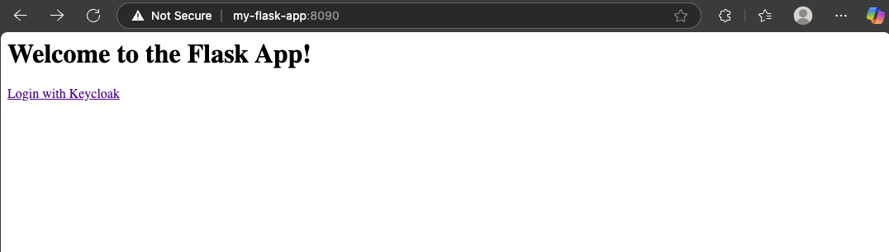
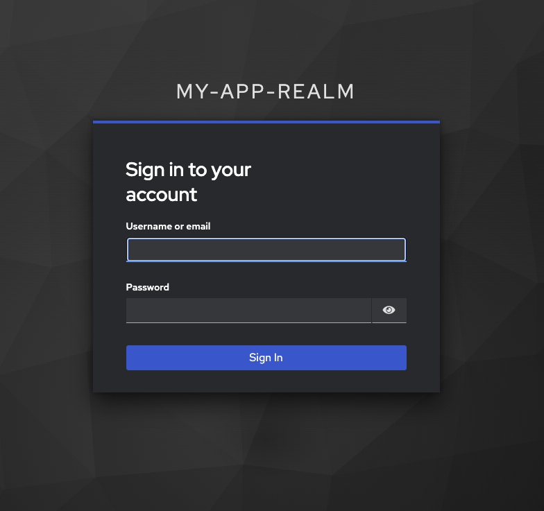
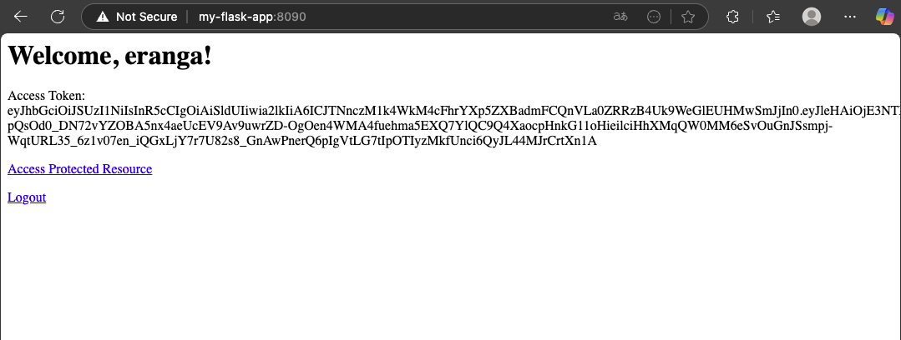
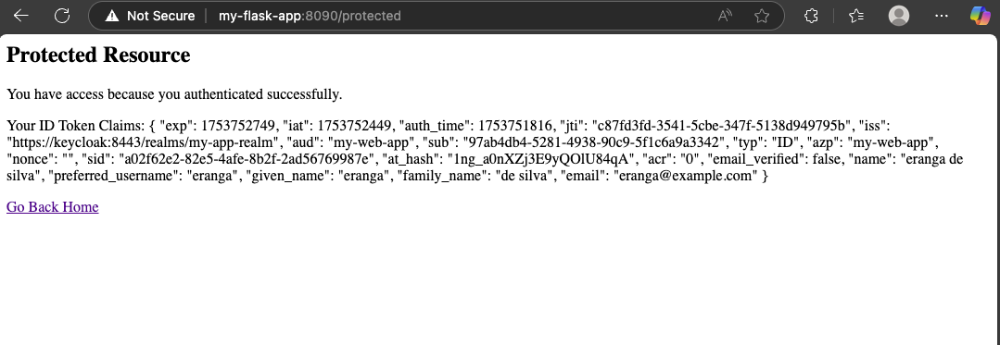

# Authorization Code Flow (Web Application)

This the the standard flow for web applications where the client can securely store a secret. 

## Concept

1. User initiates login on the client application. 

2. Client redirects user to Keycload's authoriation endpoint. This URL includes the `client_id`, `redirect_uri`, `scope` and `response_type=code`. 

3. User Authenticates with Keycloak (enters username / password). 

4. Keycloak redirects the user back to the `redirect_uri` of the client, along with an `authorization_code`. 

5. Client exchanges the `authorization_code` for an `access_token` and `refresh_token` at keycloak's token endpoint. This exchange is done server-side and includes the `client_id` and `client_secret`. 

6. Client users the `access_token` to access protected resources on the Resource Serer. 

## Implementation (Keycloak Setup)

+ Realm: my-app-realm
+ Client: my-web-app (Confidential, Standard Flow enabled)
+ Redirect URI: http://my-flask-app:8090/callback


Now, let's dissect the provided Flask application piece by piece to understand how it interacts with Keycloak.

### 1. Initial Setup and Configuration


```python
from flask import Flask, redirect, request, session, url_for
from keycloak import KeycloakOpenID # The magic library for Keycloak interaction
import json 
import os 

# Initializes a Flask App object
app = Flask(__name__)
app.secret_key = os.urandom(24) # Used for Flask Session Management

# KeyCloak Configuration
KEYCLOAK_SERVER_URL = "https://keycloak:8443/" # URL of your Keycloak server
KEYCLOAK_REALM = "my-app-realm"             # The "realm" in Keycloak where your app is registered
KEYCLOAK_CLIENT_ID = "my-web-app"           # Your application's unique ID in Keycloak
KEYCLOAK_CLIENT_SECRET = os.getenv("KEYCLOAK_CLIENT_SECRET", "vbw3lgpTtuVoq7Dl7VxKxzTzzJ4k3rjo") # Secret key for your app
KEYCLOAK_CERT_PATH = "/app/certs/keycloak-cert.pem" # Path to Keycloak's SSL certificate

# Initialize the KeycloakOpenID client
keycloak_openid = KeycloakOpenID(
    server_url=KEYCLOAK_SERVER_URL,
    realm_name=KEYCLOAK_REALM,
    client_id=KEYCLOAK_CLIENT_ID,
    client_secret_key=KEYCLOAK_CLIENT_SECRET,
    verify=KEYCLOAK_CERT_PATH # Important for secure communication with Keycloak
)
```

- **Import necessary libraries:** `flask` for the web application, `keycloak` for interacting with Keycloak, `json` for handling data, and `os` for environment variables.
    
- **Flask App Initialization:** `app = Flask(__name__)` creates our Flask web application.
    
- **`app.secret_key`:** This is crucial for **Flask session management**. Flask uses this key to cryptographically sign the session cookie, ensuring that the data stored in `session` (like user tokens) hasn't been tampered with by the client. `os.urandom(24)` generates a strong random key.
    
- **Keycloak Configuration Variables:** These define how our Flask app connects to our specific Keycloak instance.
    
    - `KEYCLOAK_SERVER_URL`: The base URL of your Keycloak server.
        
    - `KEYCLOAK_REALM`: In Keycloak, a "realm" is like a dedicated space for managing users, roles, and clients (your applications). It allows you to logically separate users and configurations.
        
    - `KEYCLOAK_CLIENT_ID`: This is the unique identifier for _your_ Flask application registered within Keycloak.
        
    - `KEYCLOAK_CLIENT_SECRET`: A confidential key known only to your Flask application and Keycloak. This is used for secure communication between your app and Keycloak, especially when exchanging authorization codes for tokens. It's best practice to load this from an environment variable (`os.getenv`). This secret gets generated when we register the app on keycloak. 
        
    - `KEYCLOAK_CERT_PATH`: If your Keycloak instance uses a self-signed certificate (common in development environments or private deployments), you need to provide the path to its certificate file so your application can securely verify Keycloak's identity. Since I have used this method (self-signed certificate) when I setup keycloak, we need to use this. 
        
- **`KeycloakOpenID` Object:** This is the core object from the `python-keycloak` library. Here I need to initialize it with all the configuration details which I defined earlier. This object will handle all the complex OAuth2/OIDC interactions for us. The `verify=KEYCLOAK_CERT_PATH` ensures that your application trusts the Keycloak server's SSL certificate. This is certificate path based verification is needed because I am using a self-signed certificate. 
    
    

### 2. The Home Page (`/`)


```python
@app.route("/")
def index():
    if "token" in session: 
        return f"""
        <html>
        <body>
        <h1>Welcome, {session.get('user_info',{}).get('preferred_username','User')}!</h1>
        <p>Access Token: {session['token'].get('access_token')}</p>
        <p><a href="/protected">Access Protected Resource</a></p>
        <p><a href="/logout">Logout</a></p>
        </body>
        </html>
        """
    
    return """
            <html>
            <body>
            <h1>Welcome to the Flask App!</h1>
            <p><a href="/login">Login with Keycloak</a></p>
            </body>
            </html>
            """
```

- This is the entry point of your application.
    
- **`if "token" in session:`**: Checks if the user has an active session with Keycloak (i.e., they've successfully logged in and we have their tokens).
    
    - If a `token` exists in the session, it displays a welcome message with the user's preferred username (obtained from the `user_info` session data), their access token, and links to a protected resource and a logout button.
        
- **Else (not logged in):** It presents a simple welcome message and a "Login with Keycloak" link, prompting the user to initiate the OAuth2 flow.
    
    

### 3. Initiating the Login Flow (`/login`)


```python
@app.route("/login")
def login():
    # Generate a state value for CSRF protection and store it in the session
    state = os.urandom(24).hex()
    session['state'] = state

    # The method `auth_url`, which returns the authorization URL.
    auth_url = keycloak_openid.auth_url(
        redirect_uri=url_for("callback", _external=True),
        scope="openid profile email",
        state=state
    )

    return redirect(auth_url)
```

This is where the OAuth2 dance begins!

1. **`state = os.urandom(24).hex()`:** A random `state` parameter is generated and stored in the Flask session. This is a **crucial security measure for CSRF (Cross-Site Request Forgery) protection**. When Keycloak redirects back to our application, it will include this `state` parameter, and our app will verify that it matches the one we sent. This ensures that the callback is indeed from a legitimate request initiated by our application, not from a malicious third party.
    
2. **`keycloak_openid.auth_url(...)`:** This method constructs the **Keycloak authorization URL**.
    
    - `redirect_uri=url_for("callback", _external=True)`: This tells Keycloak where to send the user's browser _after_ they successfully log in. It must be a URL that Keycloak is pre-configured to allow (registered as a valid redirect URI for our client in Keycloak's admin console). `_external=True` ensures a full URL is generated.
        
    - `scope="openid profile email"`: These are **OpenID Connect scopes** (permissions) that our application is requesting from Keycloak.
        
        - `openid`: This is mandatory for OpenID Connect and indicates that our application wants to perform an authentication.
            
        - `profile`: Requests access to the user's basic profile information (like name, preferred username).
            
        - `email`: Requests access to the user's email address.
            
    - `state=state`: The CSRF protection parameter.
        
3. **`return redirect(auth_url)`:** The Flask app then redirects the user's browser to this generated Keycloak authorization URL. The user will see Keycloak's login page.


    

    The user needs to key in the *username*, and *password* to authenticate himself with the keycloak server. 
    

### 4. Handling the Callback from Keycloak (`/callback`)


```python
@app.route("/callback")
def callback():
    try:
        code = request.args.get("code")
        state = request.args.get("state")
        if not code:
            return "No authorization code provided", 400
        if not state or state != session.pop("state", None):
            return "Invalid state parameter.", 400

        # Exchange authorization code for tokens using the `token` method.
        token = keycloak_openid.token(
            grant_type="authorization_code",
            code=code,
            redirect_uri=url_for("callback", _external=True)
        )

        session["token"] = token

        # Get user info using the access token
        user_info = keycloak_openid.userinfo(token["access_token"])
        session["user_info"] = user_info

        return redirect(url_for("index"))
    
    except Exception as e:
        app.logger.error(f"Error during callback: {e}")
        return f"Error during callback: {e}", 500
```

This is the most critical part of the OAuth2 flow where your application receives tokens from Keycloak.

1. **Keycloak Redirection:** After the user successfully logs in on the Keycloak page, Keycloak redirects their browser back to this `/callback` URL, including two important parameters in the URL query string:
    
    - `code`: The **authorization code**. This is a short-lived, single-use code that your application will exchange for actual tokens.
        
    - `state`: The CSRF protection parameter that you originally sent.
        
2. **`code = request.args.get("code")` and `state = request.args.get("state")`:** Your Flask app retrieves these parameters.
    
3. **State Validation:** `if not state or state != session.pop("state", None):` **Crucially, it verifies the `state` parameter.** It checks if `state` exists and matches the one stored in the session. If not, it's a potential CSRF attack, and the request is rejected. `session.pop("state", None)` removes the state from the session after use to prevent replay attacks.
    
4. **`keycloak_openid.token(...)` (Token Exchange):** This is the heart of the process. Your application sends a **direct, secure back-channel request** to Keycloak's token endpoint (not through the user's browser) to exchange the received `authorization code` for actual **tokens**.
    
    - `grant_type="authorization_code"`: Specifies the type of OAuth2 flow.
        
    - `code=code`: The authorization code received from Keycloak.
        
    - `redirect_uri=url_for("callback", _external=True)`: This must precisely match the `redirect_uri` used in the initial authorization request.
        
    - **The `keycloak_openid.token()` method handles sending your `client_id` and `client_secret` securely to Keycloak** to authenticate your application for this exchange. The `client_id` and `client_secret` were defined earlier. 
        
5. **Storing Tokens:** The `token` object returned by Keycloak typically contains:
    
    - `access_token`: A token used to access protected resources (like an API on a resource server). It represents the user's granted permissions.
        
    - `id_token`: An **OpenID Connect (OIDC) specific token** that contains information about the authenticated user (e.g., username, email, etc.). It's a signed JSON Web Token (JWT).
        
    - `refresh_token`: A long-lived token used to obtain new `access_token` and `id_token` when the current ones expire, without requiring the user to log in again.
        
    - `session["token"] = token`: All these tokens are stored securely in the Flask session.
        
6. **`keycloak_openid.userinfo(token["access_token"])`:** After getting the tokens, our app can use the `access_token` to fetch more detailed **user information** from Keycloak's `userinfo` endpoint. This data is also stored in the session (`session["user_info"]`).
    
7. **`return redirect(url_for("index"))`:** Finally, the user is redirected back to our application's home page, now in a logged-in state.
    
8. **Error Handling:** The `try...except` block catches any potential errors during the callback process, logging them and displaying a generic error message to the user.

    
    

### 5. Accessing a Protected Resource (`/protected`)


```python
@app.route("/protected")
def protected_resource():
    if "token" not in session:
        return redirect(url_for("login"))
    
    access_token = session["token"].get("access_token")

    # Example of accessing a hypothetical protected resource
    # In a real scenarios, this would be an API call to your Resource Server
    # that validates the access_token
    return f"""
    <html>
    <body>
    <h2>Protected Resource</h2>
    <p>You have access because you authenticated successfully.</p>
    <p>Your ID Token Claims:
    {json.dumps(keycloak_openid.decode_token(session['token']['id_token']), indent=2)}
    <p><a href="/">Go Back Home</a></p>
    </body>
    </html>
    """
```

- **`if "token" not in session:`:** This is your simple authorization check. If the user isn't logged in (no `token` in the session), they are redirected to the login page.
    
- **`access_token = session["token"].get("access_token")`:** Retrieves the access token from the session.
    
- **Displaying ID Token Claims:** The code then decodes the `id_token` (which is a JWT) and displays its claims. Claims are pieces of information about the user or the authentication event (e.g., `iss` for issuer, `sub` for subject/user ID, `exp` for expiration, `preferred_username`, `email`, etc.). While `decode_token` performs validation, here it's primarily used to parse and display the contents for demonstration.
    
- **Real-world Scenario:** In a real application, you wouldn't just display the access token. You would typically send this `access_token` in the `Authorization: Bearer <access_token>` header of requests to a **Resource Server** (e.g., another microservice, an API). The Resource Server would then validate this access token with Keycloak and, if valid, grant access to the requested data or functionality.

    
    

### 6. Logging Out (`/logout`)


```python
@app.route("/logout")
def logout():
    if "token" in session:
        keycloak_openid.logout(session["token"]["refresh_token"])
        session.pop("token", None)
        session.pop("user_info", None)
    return redirect(url_for("index"))
```

- **`if "token" in session:`:** Checks if the user is currently logged in.
    
- **`keycloak_openid.logout(session["token"]["refresh_token"])`:** This is crucial for proper logout. It tells Keycloak to invalidate the user's session and the `refresh_token`. This prevents the `refresh_token` from being reused to obtain new tokens after the user has explicitly logged out.
    
- **`session.pop("token", None)` and `session.pop("user_info", None)`:** These lines clear the user's authentication and profile information from your Flask application's session, effectively logging them out of your app.
    
- **`return redirect(url_for("index"))`:** Redirects the user back to the home page, where they will now see the "Login with Keycloak" option.
    
    

### 7. Running the Application


```python
if __name__ == "__main__":
    app.run(host="0.0.0.0", port=8090, debug=True)
```

- This standard Flask boilerplate runs the application.
    
    - `host="0.0.0.0"` makes the app accessible from any IP address (useful in Docker containers or remote environments).
        
    - `port=8090` specifies the port it listens on.
        
    - `debug=True` enables debug mode, which provides helpful error messages and automatically reloads the server on code changes (only for development!).
        

## The OAuth2 Flow in Action (Simplified Steps)

Let's summarize the user journey:

1. **User wants to log in:** User visits `http://your-app:8090/`.
    
2. **Redirect to Keycloak:** User clicks "Login with Keycloak" link, and our app redirects their browser to Keycloak's login page (`/login` -> `keycloak_openid.auth_url`).
    
3. **User authenticates with Keycloak:** User enters their credentials on Keycloak's login page.
    
4. **Keycloak grants Authorization Code:** If successful, Keycloak redirects the user's browser back to your app's `/callback` URL with an `authorization code` and the `state` parameter.
    
5. **App exchanges code for tokens:** Our Flask app receives the `authorization code` and `state`. It verifies the `state` parameter for security. Then, it makes a **direct, secure request to Keycloak** (using your `client_id` and `client_secret`) to exchange the `authorization code` for an `access_token`, `id_token`, and `refresh_token`.
    
6. **Tokens stored, user info fetched:** Our app stores these tokens and fetches additional user details using the `access_token` from Keycloak's userinfo endpoint. All this data is stored in the Flask session.
    
7. **User redirected to app (logged in):** The user is redirected back to our app's home page, now seeing personalized content and access to protected resources.
    
8. **Accessing Protected Resources:** When the user navigates to a protected route, our app checks if the necessary tokens are in the session. If so, it allows access. In a real-world scenario, the `access_token` would be used to authorize calls to other APIs.
    
9. **Logout:** When the user logs out, our app not only clears its local session but also informs Keycloak to invalidate the session and refresh token there, ensuring a complete logout.
    

